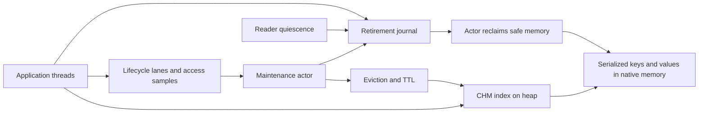

# Red OHC

[中文](README.zh-CN.md) · [Quick start](docs/quickstart.md) · [Documentation](docs/README.md) · [Architecture](docs/architecture/ARCHITECTURE.md)

Red OHC is a concurrent, serialized off-heap cache for Java applications. It keeps
key and value bytes in native memory, uses a JDK `ConcurrentHashMap` for lookup,
and runs eviction, expiry and deferred memory reclamation on a maintenance actor.

Use it for a shared cache of serialized data that can be reconstructed after a
miss. The Java index and returned objects still use heap memory. Serialization,
native allocation and background maintenance are part of its cost; measure your
workload before choosing a cache. Data belongs to one JVM process and is lost on
process exit.

The development version is **1.0.0-SNAPSHOT**. The first stable release will be
**1.0.0**; it is not available from Maven Central yet.

## Features

- Concurrent reads, writes, conditional updates, compute operations and bulk APIs.
- Serialized byte capacity or entry-count capacity with asynchronous eviction.
- S3-FIFO, LRU and Window TinyLFU policy selectors; S3-FIFO is the default.
- Default TTL and per-entry absolute expiry, with expired entries absent on reads.
- Owned deserialized values or callback-scoped direct access to serialized bytes.
- Maintenance flush futures and statistics for allocation, expiry and reclamation.

See the [API reference](docs/api.md) for concurrency and lifetime contracts.

## Quick start

With a source checkout and JDK 11 or later, run these commands from the repository
root. The Wrapper downloads and verifies the pinned Maven distribution.

```bash
./mvnw -B -DskipTests install
./mvnw -B -f examples/user-cache/pom.xml compile exec:exec
```

On Windows, use `mvnw.cmd` instead of `./mvnw`. The first command installs the
development library locally and skips test execution. The example runs in its
own JVM and prints:

```text
Red OHC: put/get/replace/remove succeeded
```

The [quick-start guide](docs/quickstart.md) includes the complete Java program,
UTF-8 serializer, configuration choices and dependency setup.

Create the cache once during application startup and share it with request
handlers. `StringSerializer` below is the complete serializer from the guide.

```java
import com.red.ohc.api.OHCache;
import com.red.ohc.cache.OHCacheBuilder;

OHCache<String, String> users = OHCacheBuilder.<String, String>newBuilder()
    .capacity(128L * 1024 * 1024)
    .defaultTTLmillis(60_000)
    .keySerializer(new StringSerializer())
    .valueSerializer(new StringSerializer())
    .build();

users.put("user:42", "Alice");
String name = users.get("user:42");
users.put("user:42", "Bob");
users.remove("user:42");
```

Caches have process lifetime and no public `close`, `stop` or `destroy` method.
Repeated cache creation retains infrastructure in a running JVM. Use a bounded
number of shared caches; `clear()` removes mappings without destroying the cache.

After **1.0.0 is published**, applications can use Maven Central without a custom
repository:

```xml
<dependency>
  <groupId>io.github.red-ead</groupId>
  <artifactId>red-ohc-core</artifactId>
  <version>1.0.0</version>
</dependency>
```

## Architecture



Writes publish data synchronously; the actor maintains policy state and releases
retired storage later. `capacity` and `maxSize` are mutually exclusive eviction
targets, so native allocation can temporarily exceed the target. Active readers
can delay reclamation. Keep headroom for the JVM, allocator pages and backlog.

`flushAsync()` waits for captured lifecycle and retirement watermarks plus the
required maintenance. Ordinary requests do not need a flush after every write.
Flush supplies neither persistence nor an atomic snapshot.

The [architecture guide](docs/architecture/ARCHITECTURE.md) explains ownership,
read/write paths, memory layout, scheduling, TTL and flush completion.

## Documentation and examples

- [Quick start](docs/quickstart.md): install the development build and run a complete example.
- [Usage guide](docs/usage.md): serializers, TTL, loading, conditional and direct operations.
- [API reference](docs/api.md): builder defaults, operation groups and failure semantics.
- [Operations guide](docs/operations.md): memory accounting and maintenance diagnostics.
- [Architecture](docs/architecture/ARCHITECTURE.md): runtime components, protocols and tradeoffs.
- [Benchmarks](docs/benchmarks.md): reproducible comparison and diagnostic tools.
- [Support](docs/support.md): target platforms and release verification requirements.

## Build and contribute

The default build includes `red-ohc-core`. The `benchmarks` profile adds
`red-ohc-jmh`; benchmark dependencies are outside the library's runtime graph.

```bash
./mvnw -B clean verify
./mvnw -B -Pbenchmarks -pl red-ohc-core,red-ohc-jmh -am checkstyle:check
git diff --check
```

The Wrapper pins Maven 3.9.16 with a SHA-256 download check. Public-only Maven
settings and full validation commands are in [CONTRIBUTING](CONTRIBUTING.md).
The target matrix is Java 11/17/21/25 on Linux/macOS/Windows; see
[support evidence](docs/support.md) for its verification boundary.

Report reproducible bugs through GitHub issues and follow [CONTRIBUTING](CONTRIBUTING.md)
for changes. Send security reports through the [security policy](SECURITY.md).
Maintainer procedures are in the [release guide](docs/releasing.md).

## Benchmarks

The fair comparison suite covers Red OHC, [snazy/OHC](https://github.com/snazy/ohc),
Ehcache, MapDB, Chronicle Map and Redis through ordinary APIs. It reports workload,
serialization and memory contracts; Redis includes its process and network costs.
Core microbenchmarks diagnose individual paths separately.

No comparative throughput or Linux x86-64 performance result is published yet.
Use the [benchmark protocol](docs/benchmarks.md) to reproduce and interpret results.

## License

Red OHC uses the [Apache License 2.0](LICENSE.txt). Retained third-party code and
attribution are listed in [NOTICE](NOTICE).
