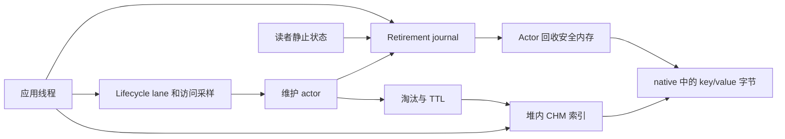

# Red OHC

[English](README.md) · [快速开始](docs/quickstart.md) · [文档导航](docs/README.md) · [架构设计](docs/architecture/ARCHITECTURE.md)

Red OHC 是面向 Java 应用的并发序列化堆外缓存。key/value 的字节存储在 native
内存，JDK `ConcurrentHashMap` 负责索引，维护 actor 负责淘汰、过期和延迟内存回收。

适合在应用内共享可序列化、丢失后能重新加载的数据。Java 索引和读取返回的对象仍使用堆内存，
序列化、native 分配和后台维护也有成本，需要用自己的负载评估。数据属于单个 JVM 进程，
进程退出后丢失。

当前开发版本为 **1.0.0-SNAPSHOT**，首个稳定版本计划为 **1.0.0**，尚未发布到 Maven Central。

## 功能

- 并发读写、条件更新、compute 操作和批量 API。
- 按序列化字节容量或条目数设定异步淘汰目标。
- S3-FIFO、LRU 和 Window TinyLFU 策略选择器，默认 S3-FIFO。
- 默认 TTL 和单条绝对过期时间，过期条目在读取时不可见。
- 返回独立反序列化对象，或通过回调直接访问序列化字节。
- 维护 flush future，以及分配、过期、回收统计。

并发和对象生命周期约定见 [API 参考](docs/api.md)。

## 快速开始

准备源码 checkout 和 JDK 11 或以上版本，从仓库根目录执行。
Wrapper 会下载固定版本 Maven，并校验下载文件。

```bash
./mvnw -B -DskipTests install
./mvnw -B -f examples/user-cache/pom.xml compile exec:exec
```

Windows 使用 `mvnw.cmd` 替代 `./mvnw`。第一条命令将开发版安装到本地 Maven 仓库，
跳过测试执行；案例使用独立 JVM，成功后输出：

```text
Red OHC: put/get/replace/remove succeeded
```

[快速开始指南](docs/quickstart.md) 包含完整 Java 程序、UTF-8 serializer、
配置说明及依赖接入步骤。

在应用启动时创建缓存，让请求处理器共用。下面的 `StringSerializer` 使用指南中的完整实现。

```java
import com.red.ohc.api.OHCache;
import com.red.ohc.cache.OHCacheBuilder;

OHCache<String, String> users = OHCacheBuilder.<String, String>newBuilder()
    .capacity(128L * 1024 * 1024)
    .defaultTTLmillis(60_000)
    .keySerializer(new StringSerializer())
    .valueSerializer(new StringSerializer())
    .build();

users.put("user:42", "Alice");
String name = users.get("user:42");
users.put("user:42", "Bob");
users.remove("user:42");
```

缓存按进程生命周期使用，没有公开的 `close/stop/destroy`。
在运行中的 JVM 反复创建缓存会保留基础设施，应使用有限数量的共享缓存。
`clear()` 删除映射，缓存仍可继续使用。

**1.0.0 发布后**，应用可以从 Maven Central 直接依赖，无需配置额外 repository：

```xml
<dependency>
  <groupId>io.github.red-ead</groupId>
  <artifactId>red-ohc-core</artifactId>
  <version>1.0.0</version>
</dependency>
```

## 架构



写操作同步发布数据，actor 随后维护策略状态并回收退休存储。
`capacity` 与 `maxSize` 只能二选一，都是淘汰目标，native 分配可能暂时超过目标。
活跃读者会延迟回收，需要为 JVM、分配器页和维护积压保留内存余量。

`flushAsync()` 等待捕获的 lifecycle/retirement 水位及必要维护完成。
普通请求无需每次写入后 flush；flush 不提供持久化或原子快照。

[架构指南](docs/architecture/ARCHITECTURE.md) 进一步解释所有权、读写路径、
内存布局、调度、TTL 及 flush 完成协议。

## 文档与案例

- [快速开始](docs/quickstart.md)：安装开发版，运行完整案例。
- [使用指南](docs/usage.md)：serializer、TTL、加载、条件操作和 direct read。
- [API 参考](docs/api.md)：builder 默认值、操作分类和失败语义。
- [运行诊断](docs/operations.md)：内存口径和维护状态排查。
- [架构设计](docs/architecture/ARCHITECTURE.md)：组件、协议与取舍。
- [Benchmark](docs/benchmarks.md)：可复现的框架对比和内部诊断工具。
- [平台支持](docs/support.md)：目标平台及发行验证要求。

## 构建与贡献

默认构建 `red-ohc-core`，`benchmarks` profile 才加入 `red-ohc-jmh`。
Benchmark 的依赖不属于核心库运行时依赖。

```bash
./mvnw -B clean verify
./mvnw -B -Pbenchmarks -pl red-ohc-core,red-ohc-jmh -am checkstyle:check
git diff --check
```

Wrapper 固定 Maven 3.9.16，并进行 SHA-256 下载校验。
公共 Maven 配置及完整验证命令见 [贡献指南](CONTRIBUTING.md)。
目标矩阵为 Linux/macOS/Windows 上的 Java 11/17/21/25，实际验证边界见 [支持说明](docs/support.md)。

通过 GitHub issue 报告可复现问题，代码贡献遵循 [CONTRIBUTING](CONTRIBUTING.md)。
安全问题按 [安全政策](SECURITY.md) 报告，维护者发行步骤见 [发布指南](docs/releasing.md)。

## Benchmark

公平对比覆盖 Red OHC、[snazy/OHC](https://github.com/snazy/ohc)、Ehcache、MapDB、
Chronicle Map 和 Redis，使用各框架普通 API。结果需要报告负载、序列化和内存约定，
Redis 还包括独立进程及网络成本；核心微基准单独用于路径诊断。

目前没有发布框架吞吐对比或 Linux x86-64 性能结果。
运行与解读方式见 [benchmark 协议](docs/benchmarks.md)。

## 许可证

采用 [Apache License 2.0](LICENSE.txt)，保留的第三方代码及归属见 [NOTICE](NOTICE)。
