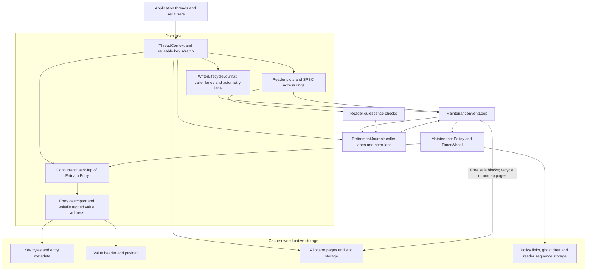

# Architecture

[Documentation](../README.md) · [Usage](../usage.md)

This guide describes `red-ohc-core/src/main/java/com/red/ohc`, with
[`OffHeapCache`](../../red-ohc-core/src/main/java/com/red/ohc/cache/OffHeapCache.java)
as the application entry implementation. The cache belongs to one JVM and owns
its native storage. Applications provide serializers and share a bounded number
of process-lifetime cache instances.

## Runtime boundary and ownership

The data path runs on application threads. A single daemon maintenance actor owns
policy links, the timer wheel and safe native reclamation. A JDK CHM is the
authoritative lookup index; the actor's policy structures mirror applied lifecycle
changes rather than replacing that index.



The stable integration surface is [`OHCache`](../../red-ohc-core/src/main/java/com/red/ohc/api/OHCache.java),
its API types and [`OHCacheBuilder`](../../red-ohc-core/src/main/java/com/red/ohc/cache/OHCacheBuilder.java).
Implementation classes are internal regardless of Java visibility. JNA provides
native allocation/mapping calls, while JCTools provides internal queue primitives.
The core runtime dependency graph excludes the JMH comparison frameworks.

| Component | Owner | Responsibility |
| --- | --- | --- |
| CHM and heap `Entry` descriptor | Concurrent caller and actor operations | Key identity, current mapping and value publication |
| `ThreadContext` and reader slot | Calling thread; registry manages registration | Lookup scratch, nested read scopes, callback views and counter deltas |
| `WriterResource` and `WriterArena` | Registry grants exclusive resource use | Native block allocation and lifecycle/retirement producer lanes |
| `WriterLifecycleJournal` | Exclusive lane producers; actor consumer | Reliable add/update/remove hints with reservation watermarks |
| `AccessRing` | One caller producer; actor consumer | Sampled, droppable policy observations |
| `MaintenancePolicy`, `EntryLinks`, `TimerWheel` | Actor | Victim selection, expiry scheduling and policy bookkeeping |
| `RetirementJournal` and `ReaderRegistry` | Producer lanes, quiescence protocol and actor | Delay native free until the relevant protected readers pass the cut |
| `NativeMemory`, `NativeAllocator` and page pool | Cache-local accounting and allocator protocols | Allocation provenance, reuse, release and physical byte accounting |

## Read path

The caller serializes a key into reusable heap scratch and enters a reader scope
before native-key lookup. The CHM resolves serialized byte identity, then the read
observes the current tagged value address. Absence and TTL checks determine
whether the operation is a hit.

```mermaid
sequenceDiagram
  participant App as Application thread
  participant Guard as ReaderGuard
  participant Index as CHM and Entry
  participant Bytes as Native value
  App->>App: Serialize lookup key into thread scratch
  App->>Guard: Publish active reader operation
  App->>Index: Lookup and observe current value
  Index-->>App: Entry and tagged address, or miss
  App->>Bytes: Check deadline if TTL; consume live payload
  App->>App: Deserialize owned value or run direct callback
  App->>Guard: Exit outermost scope and publish quiescence
  App-->>App: Return hit or miss
```

A normal live read does not acquire writer resources. Policy observations use
sampled SPSC access rings; full rings may drop observations without changing the
read result. Hit/miss counters are collected separately from policy samples.
The actor validates recorded entry generations and value addresses before using
observations, because an entry can change after the read.

An expired entry is logically absent. A read that needs an expiry hint lazily
obtains a writer resource and publishes through its lifecycle lane. Acquisition
precedes the pending publication claim, and native metadata is protected during
the subsequent recheck. Cold hints use an unseeded mutation version so the actor
reads authoritative state instead of trusting stale native data after reader exit.
See [`ReaderGuard`](../../red-ohc-core/src/main/java/com/red/ohc/runtime/ReaderGuard.java),
[`ThreadContext`](../../red-ohc-core/src/main/java/com/red/ohc/runtime/ThreadContext.java)
and [`AccessRing`](../../red-ohc-core/src/main/java/com/red/ohc/runtime/AccessRing.java).

## Write path and lifecycle publication

A caller acquires its exclusive writer resource, encodes the key and prepares
native storage. Existing-entry operations claim the entry's writer state and
validate the observed generation/value. New entries use CHM publication and a
logical-presence handoff. Logical accounting tracks published occupancy separately
from actor policy state.

Before replacing or removing a reachable native block, the write prepares the
required retirement record. Publication changes the current mapping/value
synchronously; the old block remains owned by the cache until safe reclamation.
Reservation commit/cancel, logical charges and writer release preserve that
ownership across exceptions. A post-publication failure cannot treat a reachable
block as an unpublished private allocation.

Lifecycle records carry add/update/remove hints. Pending flags and mutation
versions coalesce updates; the actor uses current entry state when a seed is stale
or absent. Lane records must be committed or cancelled, and a reserved unpublished
head stops consumption of that lane. Ready notifications let the actor visit
active lanes without scanning all producers for each record.

If a writer owns an entry when the actor reaches its hint, a retry marker hands
off responsibility. Writer release and actor retry compete through CAS; only the
winner publishes. The actor's retry lane is an ordinary journal lane owned solely
by the actor and does not create a `WriterArena`. Its turn cut is captured before
consumption, so retries produced during the turn are processed in a later turn.
See [`WriterLifecycleJournal`](../../red-ohc-core/src/main/java/com/red/ohc/maintenance/WriterLifecycleJournal.java),
[`WriterLifecycleLane`](../../red-ohc-core/src/main/java/com/red/ohc/maintenance/WriterLifecycleLane.java)
and [`Entry`](../../red-ohc-core/src/main/java/com/red/ohc/index/Entry.java).

## Eviction and TTL

`LogicalAdmission` accounts live occupancy; capacity is a target for actor eviction
rather than a synchronous admission gate. `capacity` uses logical serialized-entry
bytes, while `maxSize` uses entry count. Actor-applied policy weight can lag caller
publication, so the two states have separate roles during a flush.

`MaintenancePolicy` implements `LRU`, `W_TINY_LFU` and `S3_FIFO`. LRU consumes
sampled recency observations. Window TinyLFU uses window/probation/protected queues
and a frequency sketch with window adaptation. The S3 selector uses the implemented
S4-FIFO-lite profile: Small/Skip/Main state, saturating access counts and a native
ghost map. This selector name does not promise an exact copy of a paper's algorithm.
The ghost map retains policy history, not cached values.

Writes convert TTL to monotonic deadlines. `TimerWheel` schedules actor expiry;
caller reads also enforce deadlines immediately. The actor unlinks a validated
mapping, removes policy/timer membership and appends retirement work. Automatic
SIZE/EXPIRED listeners run on this actor before retirement finishes, with
callback-scoped lazy suppliers. A blocked listener slows all maintenance.
See [`LogicalAdmission`](../../red-ohc-core/src/main/java/com/red/ohc/maintenance/LogicalAdmission.java),
[`MaintenancePolicy`](../../red-ohc-core/src/main/java/com/red/ohc/maintenance/MaintenancePolicy.java)
and [`TimerWheel`](../../red-ohc-core/src/main/java/com/red/ohc/maintenance/TimerWheel.java).

## Retirement and reader quiescence

Retirement transports ownership of obsolete storage separately from lifecycle
policy hints. Writer lanes and the actor lane append into reusable segments.
Sealing fixes a reservation boundary; all captured reservations must resolve
before a segment can advance. QSBR means quiescent-state-based reclamation.


`ReaderGuard` publishes an odd operation sequence on entry and an even sequence
on outermost exit. Nested scopes preserve protection until depth zero. A value
protection bit distinguishes native-key lookup from replaceable-value reads.
The registry checks whether a relevant reader spans the armed cut rather than
requiring every thread to be inactive simultaneously.

SAFE segments have passed the relevant reader checks; the actor still has to free
their physical blocks. Reclaim batches group page releases and track partial
progress before reusing segments. A stalled protected reader can retain retired
memory, but the actor uses retry deadlines and notifications to park instead of
continually spinning. An expired reader-blocked retry runs one bounded pass to
re-arm reader notifications and advance the backoff deadline; it never releases
blocks that remain protected. Sources: [`ReaderRegistry`](../../red-ohc-core/src/main/java/com/red/ohc/runtime/ReaderRegistry.java),
[`RetirementJournal`](../../red-ohc-core/src/main/java/com/red/ohc/maintenance/RetirementJournal.java)
and [`RetirementSegment`](../../red-ohc-core/src/main/java/com/red/ohc/maintenance/RetirementSegment.java).

## Flush completion

`flushAsync` publishes a request with the reservation watermarks of existing
lifecycle and retirement lanes. It signals work bits and the actor's wake gate.
Concurrent flush calls can replace the active request with a later boundary while
sharing its internal completion; each public caller gets an independent future.
Cancelling one waiter does not cancel the others or maintenance.

Reservations preceding capture must commit/cancel and be processed. Later
reservations and new lifecycle lanes do not enlarge that capture. Actor-generated
retirements required by applied lifecycle work, capacity eviction or expiry extend
the retirement boundary under the publication lock. Fixed turn cuts also apply to
the actor's retry lane.

At pass completion and before idle, the actor checks lifecycle/retirement
watermarks, reader lifecycle, access work, due TTL and the capacity target for
applied work. It rechecks request identity and terminal status under the same
publication lock before completing the future. Later writes alone do not require
global journal emptiness. Later flush callers can extend the merged request.

The boundary provides maintenance convergence, not a transaction, persistent
commit or arbitrary task FIFO barrier. Reader protection can delay it; applications
should use a bounded wait outside callbacks. The implementation is in
[`MaintenanceEventLoop`](../../red-ohc-core/src/main/java/com/red/ohc/maintenance/MaintenanceEventLoop.java),
`flush`, `captureTurnCuts`, actor retirement watermark extension and `completeFlushIfIdle`.

## Memory layout and allocation

Heap storage includes CHM nodes, `Entry` descriptors, thread scratch and journal
objects. Native storage includes key bytes and metadata, value headers/payloads,
allocator pages, reader sequence tables and policy structures. Ordinary
materialization also allocates application objects on heap.

`Entry` stores a volatile tagged current-value address on heap. Key-associated
native metadata occupies a 64-byte allocator prefix, including writer, lifecycle
and policy fields. Values have a 16-byte header followed by their payload. Logical
byte charge is `64 + max(8, align8(keyBytes)) + 16 + align8(valueBytes)`.
This logical charge excludes value allocator prefixes and page/size-class slack.

`WriterArena` allocates smaller blocks from size-class pages with 64-byte-aligned
slots. `SizeClasses` chooses pages between 64 KiB and 2 MiB and sends larger blocks
to direct native allocation. Freed slots and fully empty pages can be reused;
retained or pooled pages can keep physical allocation above live payload size.
Page mapping uses anonymous mmap/munmap on Linux/macOS and VirtualAlloc/VirtualFree
on Windows. Unavailable mapping symbols use the allocator's malloc path.

Physical allocation and RSS differ because of page residency, allocator behavior
and JVM/process memory outside the cache. Alignment, per-producer lanes and reused
scratch are locality mechanisms; they do not establish throughput or universal
hardware optimality. Sources: [`ValueBlock`](../../red-ohc-core/src/main/java/com/red/ohc/storage/ValueBlock.java),
[`WriterArena`](../../red-ohc-core/src/main/java/com/red/ohc/storage/WriterArena.java),
[`SizeClasses`](../../red-ohc-core/src/main/java/com/red/ohc/storage/SizeClasses.java),
[`NativeMemory`](../../red-ohc-core/src/main/java/com/red/ohc/storage/NativeMemory.java)
and [`NativeAllocator`](../../red-ohc-core/src/main/java/com/red/ohc/storage/NativeAllocator.java).

Allocator page descriptors isolate the owner cursor/counters, the actor freed
counter and the shared free bitmap with separate inheritance padding layers.
A leading padding layer keeps subclass fields that the JVM backfills into header
gaps away from the owner fields. Layout tests check byte ranges at every possible
base offset within a 64-byte cache line; heap objects need not be line-aligned.
This isolation target is Linux/x86-64 with 64-byte cache lines, not a universal
claim about every processor. The padding belongs to each allocator page descriptor,
not each cache entry. In local HotSpot Java 11/21 measurements with 12-byte headers
and 8-byte object alignment, the descriptor grows from 280 to 368 bytes (+88 bytes
per page). CI reports actual Page and Entry sizes for its JVM configurations;
different header/pointer/alignment settings can change these sizes. Layout evidence
does not establish throughput improvement; matched Linux measurements are separate.

## Scheduling, failure and lifetime

Each actor turn captures source cuts and consumes bounded quotas. Work bits and
wake signaling cover lifecycle, retirement, access, TTL, capacity and flush work.
Ready queues choose lanes; they are not a public control mailbox. A private lazy
task queue exists for tests and does not carry production mutations or flush markers.

If maintenance becomes terminal, it rejects writes, wakes writer waiters and
fails flush requests. Allocation exhaustion can trigger this state. A cache does
not restart its actor automatically; read success does not prove maintenance health.
Serializer failures before publication ordinarily propagate to the caller with
private allocation rollback. Failures after publication require retained ownership.

Caches have process lifetime. Internal `stop` and `shutdownAndFree` support
quiesced tests/tools, with finally cleanup even after setup or flush failure.
Applications have no public shutdown API. Long callbacks, sustained churn and
many producer threads have operational costs documented in [operations](../operations.md).
The [decision record](adr/0001-synchronous-data-and-actor-maintenance.md) collects
these implemented tradeoffs. Platform and performance acceptance are separate
from this source description; see [support](../support.md) and [benchmarks](../benchmarks.md).
